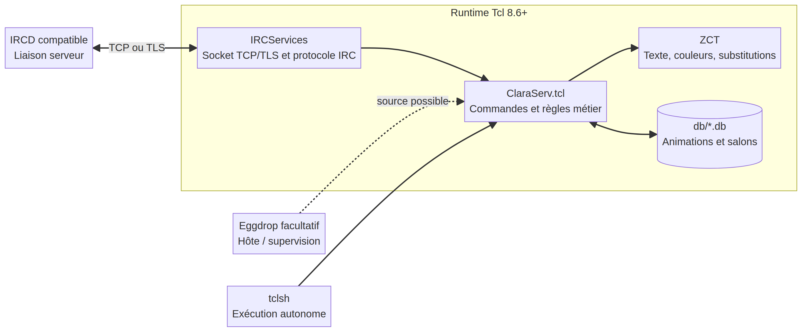

# ClaraServ

**ClaraServ** est un service IRC d’animation écrit en Tcl. Les utilisateurs déclenchent des animations configurables depuis un salon, par exemple `!gaufre` ou `!gaufre Pseudo`. Le projet se connecte à l’IRCD comme un service et crée son propre pseudoclient.

> La branche `develop` fournit ClaraServ **en Tcl autonome**. Eggdrop reste compatible comme hôte de chargement, mais il n’est plus requis pour exécuter le service.


## Sommaire

- [Fonctionnalités](#fonctionnalités)
- [Architecture](#architecture)
- [Prérequis](#prérequis)
- [Installation](#installation)
- [Configuration](#configuration)
- [Démarrage et supervision](#démarrage-et-supervision)
- [Commandes](#commandes)
- [Personnaliser les animations](#personnaliser-les-animations)
- [Diagnostic](#diagnostic)
- [Tests](#tests)
- [Contribuer](#contribuer)

## Fonctionnalités

| Fonction | Description |
|---|---|
| Animations de salon | Catalogue d’animations avec variante seule et variante ciblant un pseudonyme. |
| Commandes privées | Aide, liste, informations, ajout et retrait de salons. |
| Commandes publiques | Aide, liste, informations, animation précise ou aléatoire. |
| Catalogues FR / EN | Une base d’animations par langue, sélectionnée par `config(db_lang)`. |
| Persistance | Les salons supplémentaires sont mémorisés dans `db/salon.db`. |
| Tolérance aux entrées | Les messages reçus ne sont pas interprétés comme du code ou des listes Tcl. |
| Compatibilité | Fonctionne sous `tclsh` 8.6+ ; peut aussi être chargé par Eggdrop. |

## Architecture

ClaraServ sépare les commandes métier (`ClaraServ.tcl`), les utilitaires de texte (`modules/TCL-ZCT`) et le transport IRC/TLS (`modules/TCL-PKG-IRCServices`). Les animations restent des données déclaratives dans `db/database.fr.db` et `db/database.en.db`.



Le document [Architecture](docs/ARCHITECTURE.md) explique le choix Tcl autonome, les limites de compatibilité IRCD et un exemple de service `systemd`. Le [guide de développement](docs/DEVELOPMENT.md) décrit l’ajout de commandes et de tests, tandis que la [qualification des issues historiques](docs/ISSUE_TRIAGE.md) précise leur traitement.

## Prérequis

ClaraServ exige **Tcl 8.6 ou plus récent**. Il nécessite aussi une liaison serveur autorisée par votre IRCD. Le module TclTLS est requis si `config(uplink_ssl)` vaut `1`.

| Élément | Version / condition | Vérification |
|---|---|---|
| Tcl | 8.6+ | `tclsh <<< 'puts [info patchlevel]'` |
| TclTLS | seulement avec TLS | `tclsh <<< 'package require tls; puts [package present tls]'` |
| IRCD | liaison de serveur compatible | consultez la documentation de votre IRCD |
| Eggdrop | facultatif | nécessaire seulement pour le mode historique |

Les séquences de liaison actuelles ciblent principalement les IRCD compatibles avec `PROTOCTL`, `SID`, `UID` et `SJOIN`, comme UnrealIRCd. Vérifiez impérativement votre version d’IRCD dans un environnement de préproduction avant toute mise en production.

## Installation

Clonez le dépôt puis créez votre fichier de configuration local, qui ne doit jamais être versionné.

```bash
git clone https://github.com/ZarTek-Creole/TCL-ClaraServ.git /opt/claraserv
cd /opt/claraserv
cp ClaraServ.Example.conf ClaraServ.conf
chmod 600 ClaraServ.conf
```

Le dépôt contient les modules nécessaires directement dans l’arborescence ; aucun sous-module n’est requis pour une installation standard.

### Mode recommandé : Tcl autonome

Éditez `ClaraServ.conf`, puis démarrez le service directement :

```bash
cd /opt/claraserv
tclsh ClaraServ.tcl
```

L’exécution directe conserve la boucle événementielle Tcl active. En production, utilisez le service `systemd` documenté dans [Architecture](docs/ARCHITECTURE.md#migration-recommandée), plutôt qu’une session shell persistante.

### Mode historique : Eggdrop

Si vous souhaitez conserver Eggdrop comme hôte, ajoutez dans sa configuration :

```tcl
source /opt/claraserv/ClaraServ.tcl
```

Puis rechargez votre configuration Eggdrop. ClaraServ ne dépend plus des commandes spécifiques d’Eggdrop, mais les journaux s’intègrent à `putlog` lorsqu’il est disponible.

## Configuration

Renommez `ClaraServ.Example.conf` en `ClaraServ.conf` et adaptez chaque valeur à votre réseau. Le fichier contient des commentaires détaillés et doit rester lisible uniquement par l’utilisateur de service.

| Paramètre | Rôle | Exemple |
|---|---|---|
| `uplink_host` / `uplink_port` | Adresse et port de la liaison serveur | `127.0.0.1` / `7000` |
| `uplink_ssl` | Active TLS avec `1` | `1` |
| `uplink_password` | Secret de la liaison IRCD | valeur longue et aléatoire |
| `serverinfo_name` / `serverinfo_id` | Identité de serveur du service | `services.example.net` / `00C` |
| `service_nick` | Pseudoclient visible des utilisateurs | `ClaraServ` |
| `service_channel` | Salon de journalisation | `#services` |
| `service_modes` / `service_usermodes` | Modes dépendants de l’IRCD | `+Soiq` / `+o` |
| `admin_password` | Mot de passe des commandes `join` et `part` | valeur longue et distincte |
| `db_lang` | Catalogue d’animations | `fr` ou `en` |

Ne laissez jamais la valeur d’exemple `votre-mot-2-pass` : ClaraServ la rejette maintenant avant toute connexion. Le mot de passe d’administration est une solution de compatibilité historique ; une future version doit préférer une ACL basée sur un compte IRC ou un masque autorisé.

### Exemple de liaison UnrealIRCd

Le nom et le mot de passe doivent correspondre à votre configuration ClaraServ. Les directives exactes varient selon les versions d’UnrealIRCd ; utilisez ce bloc uniquement comme point de départ et validez-le auprès de la documentation de votre version.

```conf
listen 127.0.0.1:7000 {
    options { serversonly; tls; };
};

ulines { services.example.net; };

link services.example.net {
    username *;
    hostname 127.0.0.1;
    port 7000;
    hub *;
    password-connect "CHANGE_ME";
    password-receive "CHANGE_ME";
    class servers;
};
```

## Démarrage et supervision

Les journaux d’exécution remontent vers stderr en mode autonome et vers `putlog` sous Eggdrop. Pour un service `systemd`, suivez les journaux avec :

```bash
sudo journalctl -u claraserv -f
```

Activez temporairement le diagnostic du protocole avec :

```tcl
set config(uplink_debug) 1
```

N’exposez jamais les journaux de débogage publiquement sans supprimer les adresses, identifiants, messages privés et secrets.

## Commandes

### Messages privés à ClaraServ

| Commande | Description |
|---|---|
| `help` | Affiche l’aide. |
| `cmds` | Envoie la liste des animations disponibles. |
| `about` | Affiche la version et les dépendances. |
| `join <#salon> <mot_de_passe_admin>` | Ajoute ClaraServ à un salon et le mémorise. |
| `part <#salon> <mot_de_passe_admin>` | Retire ClaraServ d’un salon mémorisé, sauf le salon de journalisation. |

### Messages publics dans un salon

| Commande | Description |
|---|---|
| `!help` | Envoie l’aide en privé. |
| `!cmds` | Envoie la liste des animations en privé. |
| `!about` | Envoie les informations de version en privé. |
| `!random [pseudo]` | Exécute une animation choisie aléatoirement. |
| `!commande [pseudo]` | Exécute l’animation demandée. |


## Personnaliser les animations

Les animations sont déclarées deux fois : niveau `0` quand l’utilisateur agit seul, puis niveau `1` lorsqu’il cible un pseudonyme. Ajoutez ces deux lignes dans le catalogue choisi (`db/database.fr.db` ou `db/database.en.db`) :

```tcl
{{!salut} {0} {<c07>%sender%<c12> salue chaleureusement le salon.}}
{{!salut} {1} {<c07>%sender%<c12> salue chaleureusement <c04>%pseudo%<c12>.}}
```

| Substitution | Valeur injectée |
|---|---|
| `%sender%` | Pseudonyme de la personne qui exécute l’animation. |
| `%pseudo%` | Cible facultative de l’animation. |
| `%chan%` / `%destination%` | Salon de destination. |
| `%hour%`, `%minutes%`, `%seconds%` | Heure locale avec zéro initial. |
| `%hour_short%`, `%minutes_short%`, `%seconds_short%` | Heure locale sans zéro initial. |
| `%day%`, `%day_num%`, `%month%`, `%month_num%`, `%year%` | Date locale formatée. |
| `%botnick%` | Pseudonyme configuré pour ClaraServ. |

Au chargement, ClaraServ rejette les entrées dupliquées et les niveaux autres que `0` ou `1`. Lancez les tests avant de déployer un catalogue modifié.

## Diagnostic

| Symptôme | Vérification / action |
|---|---|
| Échec de connexion | Vérifiez hôte, port, mot de passe de liaison, certificat TLS et autorisation du lien côté IRCD. |
| Collision de SID | Choisissez une valeur `serverinfo_id` unique sur le réseau. |
| Aucune commande ne répond | Confirmez que ClaraServ a joint le salon et que la base de la langue choisie est chargée. |
| `unmatched open brace in list` | Passez à cette version : le parsing des messages reçus ne les traite plus comme des listes Tcl. |
| Erreur de configuration | Consultez le nom exact du paramètre indiqué dans les journaux ; toutes les valeurs requises sont vérifiées au démarrage. |

Pour signaler un défaut reproductible, utilisez le [sélecteur d’issues](https://github.com/ZarTek-Creole/TCL-ClaraServ/issues/new/choose). Les formulaires FR/EN demandent les versions de Tcl et de l’IRCD, les étapes de reproduction et les journaux expurgés.

## Tests

La suite de régression ne nécessite ni Eggdrop ni IRCD. Elle valide l’indexation du catalogue, la sécurité du parsing, la configuration et la persistance des salons.

```bash
cd /opt/claraserv
tclsh tests/test_claraserv.tcl
```

Un résultat attendu se termine par :

```text
Tous les tests ClaraServ sont passés.
```

## Contribuer

Créez une branche, ajoutez un test pour toute correction de logique, exécutez la suite puis ouvrez une pull request. Les nouvelles fonctions doivent respecter la séparation entre transport IRC, logique métier et stockage.

```bash
git checkout -b feature/ma-fonction
tclsh tests/test_claraserv.tcl
git add .
git commit -m "feat: ajouter ma fonction"
git push origin feature/ma-fonction
```

Les rapports de bogue et demandes d’évolution sont disponibles en français et en anglais depuis le [sélecteur d’issues](https://github.com/ZarTek-Creole/TCL-ClaraServ/issues/new/choose).

## Licence

Ce projet est publié sous licence [CC BY 4.0](https://creativecommons.org/licenses/by/4.0/).
